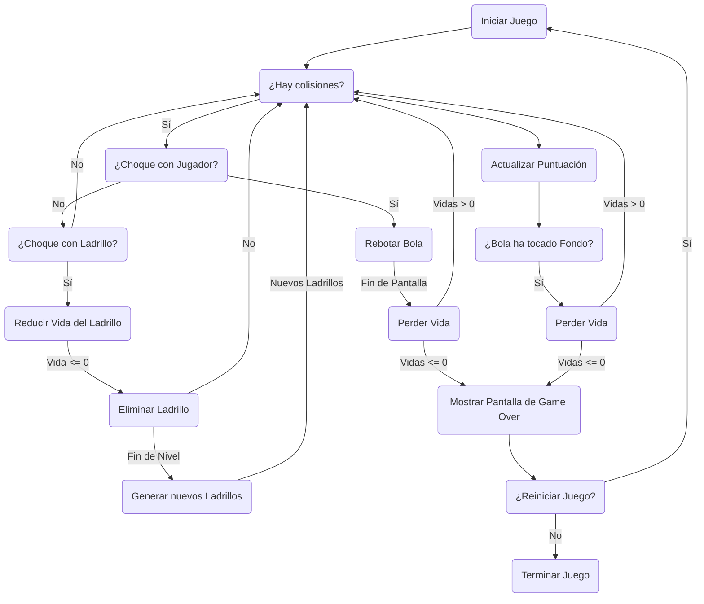
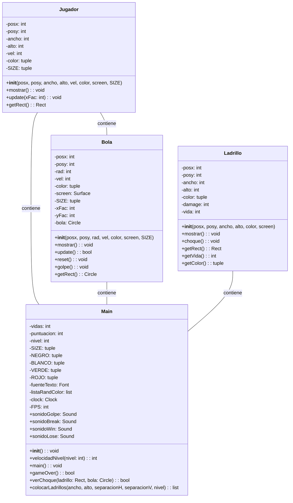
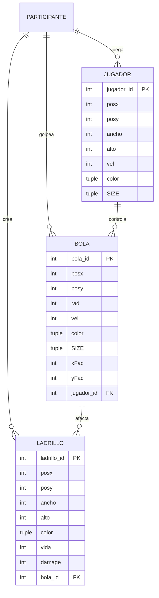
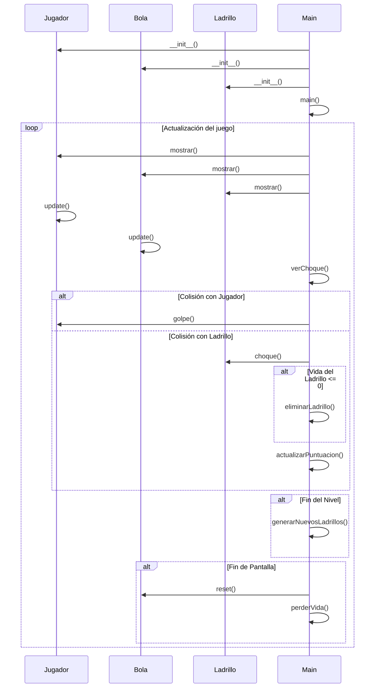

---

# Documentación del Juego "Pin Pon?"

## Introducción
"Pin Pon?" es un juego arcade clásico desarrollado en Python utilizando la biblioteca Pygame. El objetivo del juego es romper los ladrillos ubicados en la parte superior de la pantalla con una bola controlada por el jugador. El juego incluye múltiples niveles de dificultad, puntuación, vidas y efectos de sonido.

## Estructura del Proyecto
El proyecto está organizado en cuatro archivos principales ubicados en el directorio "Clases":
- **Bola.py**: Contiene la clase que define el comportamiento de la bola en el juego.
- **Jugador.py**: Define la clase que representa al jugador y su interacción con la bola.
- **Ladrillo.py**: Contiene la clase que representa los ladrillos que deben ser destruidos para avanzar en el juego.
- **Main.py**: Implementa la lógica principal del juego y gestiona la interfaz gráfica.

## Clase Bola
La clase Bola define el comportamiento de la bola en el juego. Algunas características importantes incluyen:
- Movimiento de rebote dentro del área de juego.
- Detección de colisiones con los bordes y los objetos del juego.
- Métodos para actualizar la posición de la bola y mostrarla en pantalla.

## Clase Jugador
La clase Jugador representa al jugador y su interacción con la bola. Sus funcionalidades clave son:
- Movimiento horizontal controlado por el usuario.
- Detección de colisiones con la bola y los bordes del área de juego.
- Métodos para actualizar la posición del jugador y mostrarlo en pantalla.

## Clase Ladrillo
La clase Ladrillo modela los ladrillos que deben ser destruidos en el juego. Sus características incluyen:
- Vida y color variados que afectan la puntuación del jugador.
- Detección de colisiones con la bola y métodos para reducir su vida.
- Representación visual en la pantalla.

## Lógica del Juego
El archivo Main.py implementa la lógica principal del juego. Algunas de sus características son:
- Inicialización de Pygame y configuración de la pantalla.
- Gestión de eventos de teclado y detección de colisiones.
- Actualización de la posición de los objetos y renderizado en pantalla.
- Manejo de puntuación, vidas, niveles y efectos de sonido.
- Funciones adicionales como la colocación de ladrillos y la detección de fin de juego.

## Conclusiones
El juego "Pin Pon?" ofrece una experiencia entretenida y desafiante para los jugadores de todas las edades. Su código bien estructurado y modular facilita la comprensión y la ampliación del juego con nuevas características. La documentación proporcionada aquí sirve como una guía útil para entender el funcionamiento interno del juego y su implementación en Python con Pygame.

---

# flowchart

# class diagram

# Entity Relationship Diagram

# Sequence Diagram

