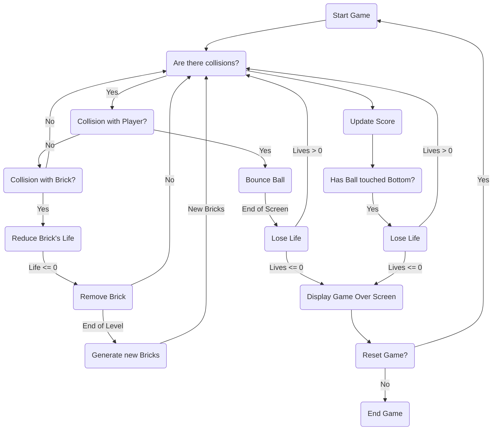
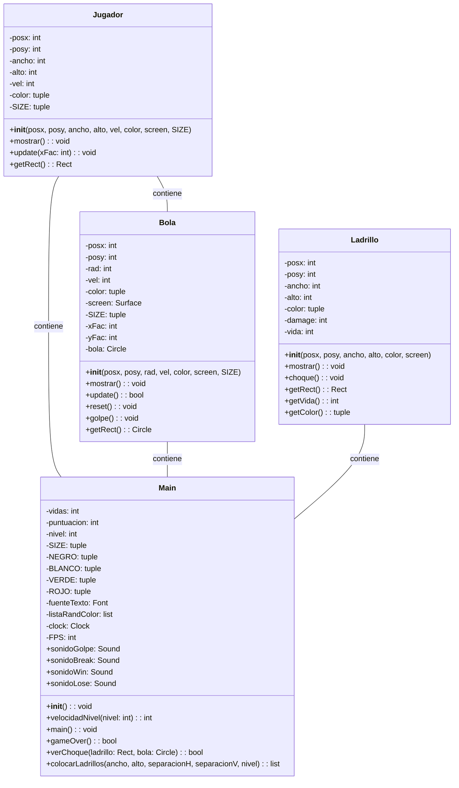
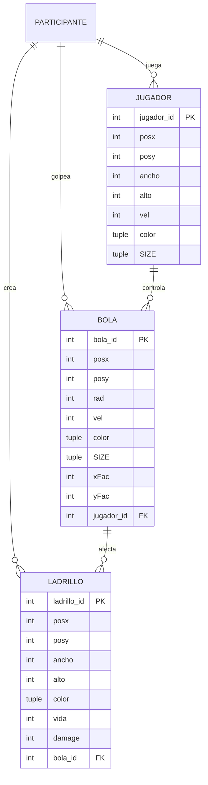
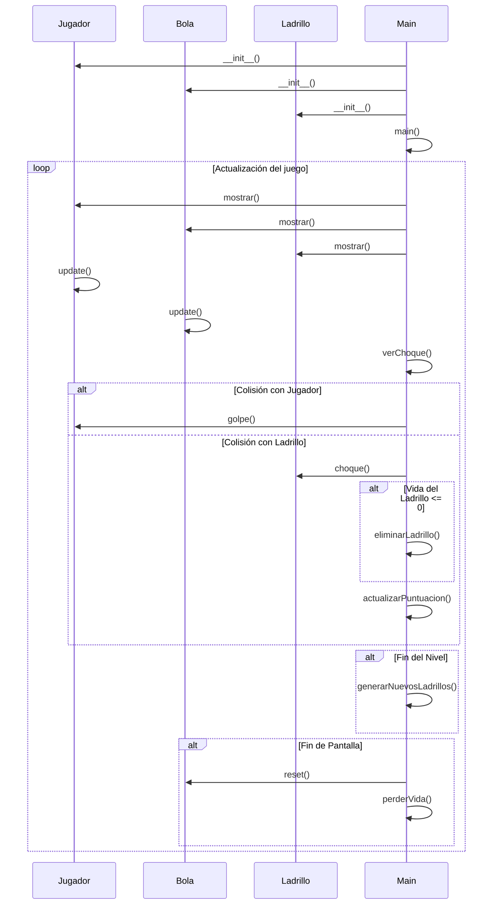

---

# "Pin Pon?" Game Documentation

## Introduction
"Pin Pon?" is a classic arcade game developed in Python using the Pygame library. The objective of the game is to break the bricks located at the top of the screen with a ball controlled by the player. The game includes multiple levels of difficulty, scoring, lives, and sound effects.

## Project Structure
The project is organized into four main files located in the "Classes" directory:
- **Bola.py**: Contains the class that defines the behavior of the ball in the game.
- **Jugador.py**: Defines the class representing the player and its interaction with the ball.
- **Ladrillo.py**: Contains the class representing the bricks that need to be destroyed to advance in the game.
- **Main.py**: Implements the main logic of the game and manages the graphical interface.

## Bola Class
The Bola class defines the behavior of the ball in the game. Some key features include:
- Bouncing movement within the game area.
- Collision detection with the edges and objects of the game.
- Methods to update the position of the ball and display it on the screen.

## Jugador Class
The Jugador class represents the player and its interaction with the ball. Its key functionalities are:
- Horizontal movement controlled by the user.
- Collision detection with the ball and the edges of the game area.
- Methods to update the player's position and display it on the screen.

## Ladrillo Class
The Ladrillo class models the bricks that need to be destroyed in the game. Its features include:
- Varied life and color affecting the player's score.
- Collision detection with the ball and methods to reduce its life.
- Visual representation on the screen.

## Game Logic
The Main.py file implements the main logic of the game. Some of its features include:
- Pygame initialization and screen setup.
- Keyboard event handling and collision detection.
- Update of object positions and rendering on the screen.
- Management of score, lives, levels, and sound effects.
- Additional functions such as brick placement and end-game detection.

## Conclusion
The "Pin Pon?" game offers an entertaining and challenging experience for players of all ages. Its well-structured and modular code facilitates understanding and expansion of the game with new features. The documentation provided here serves as a useful guide to understand the internal workings of the game and its implementation in Python with Pygame.

---

# flowchart

# class diagram

# Entity Relationship Diagram

# Sequence Diagram

# Variable Dictionary
-------------------

### Bola Class
- `posx`: Integer representing the x-coordinate position of the ball.
- `posy`: Integer representing the y-coordinate position of the ball.
- `rad`: Integer representing the radius of the ball.
- `vel`: Integer representing the velocity of the ball.
- `color`: Tuple representing the color of the ball.
- `screen`: Pygame Surface object representing the game screen.
- `SIZE`: Tuple representing the size of the game screen.
- `xFac`: Integer representing the x-direction factor of the ball's movement.
- `yFac`: Integer representing the y-direction factor of the ball's movement.
- `bola`: Pygame Circle object representing the ball.

### Jugador Class
- `posx`: Integer representing the x-coordinate position of the player.
- `posy`: Integer representing the y-coordinate position of the player.
- `ancho`: Integer representing the width of the player.
- `alto`: Integer representing the height of the player.
- `vel`: Integer representing the velocity of the player.
- `color`: Tuple representing the color of the player.
- `screen`: Pygame Surface object representing the game screen.
- `SIZE`: Tuple representing the size of the game screen.
- `jugadorRect`: Pygame Rect object representing the player's rectangle.

### Ladrillo Class
- `posx`: Integer representing the x-coordinate position of the brick.
- `posy`: Integer representing the y-coordinate position of the brick.
- `ancho`: Integer representing the width of the brick.
- `alto`: Integer representing the height of the brick.
- `color`: Tuple representing the color of the brick.
- `damage`: Integer representing the damage inflicted by the brick.
- `screen`: Pygame Surface object representing the game screen.
- `vida`: Integer representing the health of the brick.
- `ladrilloRect`: Pygame Rect object representing the brick's rectangle.

### Main
- `vidas`: Integer representing the number of lives remaining.
- `puntuacion`: Integer representing the player's score.
- `nivel`: Integer representing the current level of the game.
- `SIZE`: Tuple representing the size of the game screen.
- `bgImg`: Pygame Surface object representing the background image.
- `NEGRO`: Tuple representing the color black.
- `BLANCO`: Tuple representing the color white.
- `VERDE`: Tuple representing the color green.
- `ROJO`: Tuple representing the color red.
- `fuenteTexto`: Pygame Font object representing the text font.
- `listaRandColor`: List containing randomly selected colors for bricks.
- `screen`: Pygame Surface object representing the game screen.
- `clock`: Pygame Clock object representing the game clock.
- `FPS`: Integer representing the frames per second of the game.

---

**How the Game Works**

1. **Objective of the Game**: The objective of the game "Pin Pon?" is to destroy all the bricks at the top of the screen using a bouncing ball and a paddle that you move from left to right.

2. **Game Elements**:
   - **Ball**: It's a small circle that bounces around the screen. Your goal is to hit it with the paddle so that it hits the bricks.
   - **Paddle**: It's a horizontal bar that you can move from left to right using the arrow keys. You must control it to hit the ball and prevent it from falling off the screen.
   - **Bricks**: These are colored blocks arranged at the top of the screen. You must hit them with the ball to destroy them and progress in the game.

3. **How to Play**:
   - Start the game and control the paddle using the left and right arrow keys.
   - Hit the ball with the paddle so that it bounces and hits the bricks.
   - Try to destroy all the bricks before the ball falls off the screen.
   - If the ball falls off the screen, you'll lose a life. If you lose all your lives, the game ends.
   - Each time you destroy a brick, you'll earn points. Advance through the levels and try to achieve the highest score possible.

4. **Levels and Difficulty**:
   - The game may have multiple levels with different arrangements of bricks and ball speeds.
   - As you advance to higher levels, the speed of the ball may increase, making it more challenging to hit with the paddle.

5. **End of the Game**:
   - The game ends when you lose all your lives and can no longer continue.
   - You can retry from the first level if you wish.

---

# Metricas de Software

1. **Clase Bola**:
    - `Lineas de Codigo (LOC)`: 29
    - `Numero de Metodos`: 6
    - `Complejidad Ciclomatica`: 3
    - `Cohesion`: Alta
    - `Acoplamiento`: Medio?
2. **Clase Jugador**:
    - `Lineas de Codigo (LOC)`: 20
    - `Numero de Metodos`: 4
    - `Complejidad Ciclomatica`: 2
    - `Cohesion`: Alta
    - `Acoplamiento`: Medio?
3. **Clase Ladrillo**:
    - `Lineas de Codigo (LOC)`: 31
    - `Numero de Metodos`: 6
    - `Complejida Ciclomatica`: 4
    - `Cohesion`: Alta
    - `Acoplamiento`: Medio?
4. **Clase Main**:
    - `Lineas de Codigo (LOC)`: 150
    - `Numero de Metodos`: 5
    - `Complejidad Ciclomatica`: 42
    - `Cohesion`: Alta
    - `Acoplamiento`: Alta

5. **Total**:
    - `Lineas de Codigo (LOC)`: 230
    - `Profundidad de Clase`: 2
    - `Nodos`: 4
    - `Frecuencia de Herencia` : 2

**Frecuencia de Herencia**:
 - ${\sum{Nodos}\over\sum{Profundida-de-Clase}}=Frecuencia-de-Herencia$

**Tamaño del Software - LOC**

- ***Es la cantidad de Lineas de Codigo dentro del porjecto***

**Complejidad Ciclomatica**:

- ***Es la Cantidad de codigo que evalua cosas, Es decir es la cantidad de puntos de decicion Ej: `if` `else` `while` `for`***

**Acoplamiento**:

- ***Hace Referencia a que tanto depende un Modulo o Clase de otros Modulos o Clases***

**Cohesion**:

- ***Hace Referencia a que tanto se relacionan entre si los Modulos o Clases, Es Decir que tanto Hereda una clase de Otra***

**Ecuaciones**

1. **Densidad de Defectos**:
    - Relacion entre la cantidad de errores y El Total de Lineas de Codigo. 
    - ${Nr} \over {Nc}$
    - En Donde Nr = Numero de Errores y Nc = Numero de Lineas de Codigo 
    - $\sum_{Nr} \over \sum_{Nc}$ 
    - ${{2}\over{230}}={0,008}$
